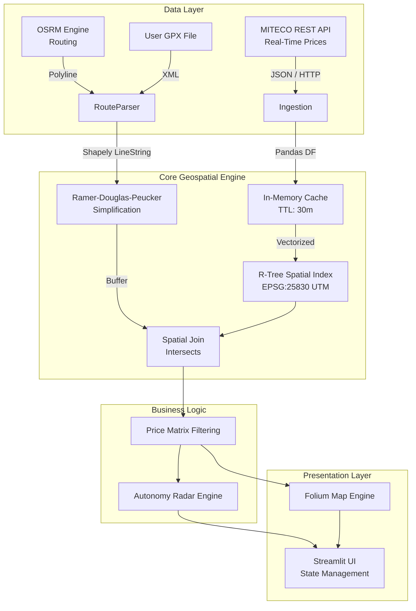

# ⛽ Gasolineras GPX: Optimizador Geoespacial de Repostaje en Ruta

[](https://www.python.org/) [](https://streamlit.io/) [](https://geopandas.org/) [](LICENSE) [](https://gasolineras-gpx-optimizador-de-repostaje-en-ruta-8kktqr5lfcts9.streamlit.app/)

> **Executive Summary**  
> Una solución analítica integral que resuelve el problema del enrutamiento óptimo de combustible. Mediante la paralelización de ingesta de datos en tiempo real (API REST MITECO), indexación espacial (R-Tree) e inferencia geoespacial avanzada, la plataforma identifica puntos de repostaje asimétricos (alto ahorro, mínimo desvío) a lo largo de cualquier corredor de transporte en España continental. Diseñado con foco en eficiencia de memoria y escalabilidad sin servidor.
>
> 🚀 **Prueba la herramienta ahora mismo aquí:** [https://gasolineras-gpx-optimizador-de-repostaje-en-ruta-8kktqr5lfcts9.streamlit.app/](https://gasolineras-gpx-optimizador-de-repostaje-en-ruta-8kktqr5lfcts9.streamlit.app/)

---

## 🏛️ System Architecture

El sistema está diseñado bajo un paradigma de **ETL Geoespacial On-the-Fly** y arquitectura modular por capas, separando el motor de inferencia de la capa de presentación interactiva.



### 🧠 Core Engineering Principles

1. **Eficiencia Computacional y Vectorización**: En lugar de calcular distancias iterativas, el sistema proyecta las geometrías globales (WGS84 EPSG:4326) a un sistema de coordenadas métrico europeo (UTM 30N EPSG:25830). Esto habilita el uso de operaciones de álgebra matricial puras a través de `GeoPandas` y `Shapely`.
2. **Indexación Espacial (R-Tree)**: La evaluación de más de 12,000 estaciones de servicio frente a polígonos irregulares complejos se resuelve en tiempo sub-lineal $\mathcal{O}(\log n)$ aprovechando el índice R-Tree de la librería GEOS subyacente.
3. **Convexidad en el Ciclo de Vida del Dato**: Mitigación agresiva del coste computacional. Aplicación del algoritmo *Ramer-Douglas-Peucker* para reducir la complejidad topológica del track de entrada en un 90% (de decenas de miles de nodos a cientos) sin pérdida de precisión de corredor.
4. **Memory-Safe State Management**: Diseñado específicamente para entornos de recursos constreñidos (ej. Streamlit Cloud limit = 1GB RAM). Gestión delérrima de las instancias de Geometría en caché nativa, previniendo los memory leaks típicos del marshalling Pickle.

---

## 📊 Propuesta de Valor y Funcionalidades CORE

- **Routing Agóstico Multi-Modal**: Soporte nativo de tracks crudos GPS (`.gpx`) abriendo el pipeline asíncrono, o resolución *Text-to-Route* usando Geocoding en cascada inversa (`Nominatim` OSM) y resolución de grafos (`OSRM`).
- **Planificación Manual Interactiva**: Creación de planes de viaje personalizados que te permite elegir con precisión en qué gasolineras parar interactuando directamente con el ranking y el mapa dinámico.
- **Inteyección y Track Splicing Automático**: El motor re-traza tu `.gpx` crudo. Usando OSRM calcula los caminos exactos de desvío e incorporación a las estaciones, cosiéndolos geométricamente sobre el track principal, produciendo un GPX enriquecido y listo para dispositivos de navegación GPS.
- **Responsive Viewport Routing**: La UI detecta iterativamente el ancho del cliente usando inyecciones JS y monta arquitecturas visuales diferenciadas para entornos Desktop y Mobile de forma fluida.
- **Autonomy Radar (Risk Engine)**: Cálculo determinista de *gaps* continuos de servicio sobre la proyección vectorial de la ruta. Clasifica los clústers espaciales en zonas seguras, de atención o críticas en base a un threshold paramétrico definido por el usuario (autonomía del vehículo).
- **Ruta Demo On-Board (Sierra de Gredos)**: Prueba la herramienta al vuelo pulsando un botón. Carga dinámicamente una compleja ruta circular por la Sierra de Gredos con 6 puertos de montaña para validar el comportamiento geoespacial bajo condiciones complicadas.

---

## 💻 Tech Stack & Dependencies

El ecosistema tecnológico ha sido auditado para minimizar la superficie de vulnerabilidad y mantener un tiempo de orquestación local < 3 segundos.

| Componente | Stack Principal | Racional Técnico |
| :--- | :--- | :--- |
| **GIS Foundation** | `geopandas`, `shapely`, `pyproj` | Análisis vectorial C-bound (GEOS/PROJ) para máxima velocidad de ejecución. |
| **Frontend & UX** | `streamlit`, `streamlit-folium`, `altair` | Interfaz declarativa orientada a componentes. Reactividad SSR nativa sin overhead de JavaScript. |
| **Data Orchestration** | `pandas`, `requests` | Manejo de dataframes in-memory y llamadas HTTP con gestión de retries / timeouts empíricos. |
| **Parsing** | `gpxpy` | Deserialización determinista nativa para XML Topológico. |

> Se incluyen configuraciones estrictas en el archivo `requirements.txt` (`>=`) garantizando que el entorno de despliegue resuelva el dependency graph de manera estable.

---

## 🛠️ Despliegue en Entorno de Desarrollo Local

El repositorio adopta estándares POSIX para una inicialización robusta y sin complicaciones.

**1. Clonar el repositorio y acceder al entorno**

```bash
git clone https://github.com/Chane12/Gasolineras-GPX-Optimizador-de-Repostaje-en-Ruta.git
cd Gasolineras-GPX-Optimizador-de-Repostaje-en-Ruta
```

**2. Aprovisionar el Entorno Virtual Aislado**

```bash
python -m venv venv
# Linux / macOS
source venv/bin/activate
# Windows
.\venv\Scripts\Activate.ps1
```

**3. Instalar Dependencias del Core**

```bash
pip install --upgrade pip
pip install -r requirements.txt
```

*(Nota sobre Windows: Si el compilador C++ advierte sobre binarios de `fiona`/`gdal`, se recomienda inyectar Wheel binaries compaginados desde ecosistema Conda).*

**4. Inicializar Aplicación**

```bash
streamlit run app.py
```

---
