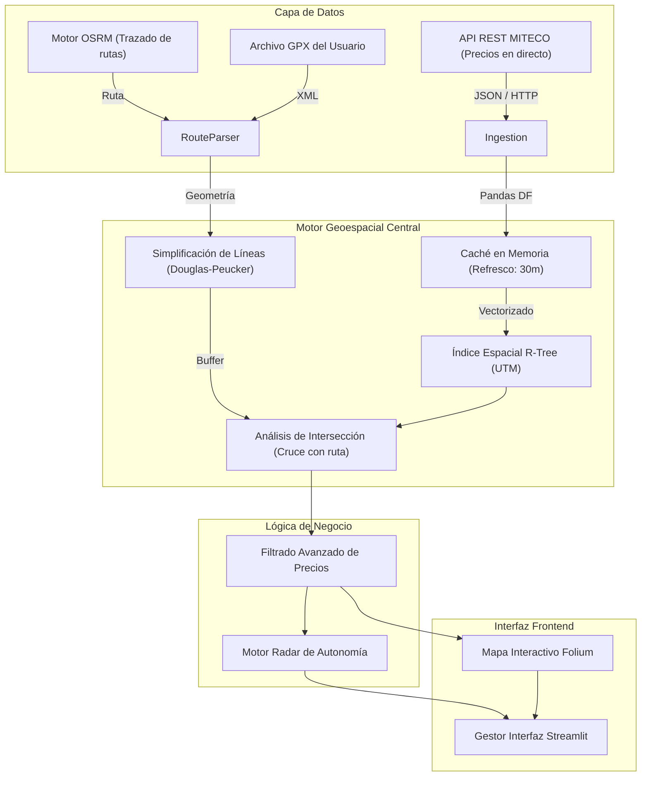

# ⛽ Gasolineras GPX: Optimizador Geoespacial de Repostaje en Ruta

[](https://www.python.org/) [](https://streamlit.io/) [](https://geopandas.org/) [](LICENSE) [](https://gasolineras-gpx-optimizador-de-repostaje-en-ruta-8kktqr5lfcts9.streamlit.app/)

> **Resumen Ejecutivo**  
> Esta herramienta resuelve el problema de organizar las paradas de repostaje de manera óptima durante tu viaje. Conectándose en tiempo real a los datos del Ministerio para la Transición Ecológica (MITECO), el sistema cruza tu ruta con las más de 12.000 gasolineras de España para identificar aquellas que ofrecen el mayor ahorro con el menor desvío posible. Todo ello procesado a alta velocidad gracias a técnicas avanzadas de indexación espacial, diseño eficiente y con bajo consumo de memoria.
>
> 🚀 **Prueba la herramienta ahora mismo aquí:** [https://gasolineras-gpx-optimizador-de-repostaje-en-ruta-8kktqr5lfcts9.streamlit.app/](https://gasolineras-gpx-optimizador-de-repostaje-en-ruta-8kktqr5lfcts9.streamlit.app/)

---

## 🏛️ Arquitectura del Sistema

El sistema funciona de manera escalonada, donde un potente motor interno realiza los cálculos geoespaciales y le pasa los datos limpios a la interfaz de usuario interactiva (Streamlit).



### 🧠 Principios Técnicos Clave

1. **Eficiencia Vectorial**: En lugar de medir distancias de gasolinera en gasolinera tradicionalmente, proyectamos todo el mapa a coordenadas métricas (UTM). Esto permite calcular las distancias en milisegundos usando álgebra matricial con librerías `GeoPandas` y `Shapely`.
2. **Índice Espacial (R-Tree)**: Para encontrar rápido qué estaciones están cerca de tu corredor sin bloquear el servidor, la herramienta indexa inteligentemente el territorio (buscando solo en las "cajas" geográficas por las que pasa la ruta).
3. **Simplificación Inteligente**: Procesar un track GPX con miles de puntos colapsaría el sistema. Usamos un algoritmo matemático que comprime y recorta la trayectoria hasta en un 90% (dejando los vértices elementales) sin que pierda fidelidad con la carretera real.
4. **Protección de Memoria Sensible**: Diseñado a medida para entornos de despliegue ligeros (como Streamlit Cloud con límite real de ~1GB RAM). Se controla rigurosamente la gestión del estado para evitar sobrecargas u "fugas de memoria" habituales (memory leaks).

---

## 📊 Propuesta de Valor y Funcionalidades CORE

- **Construcción de Rutas Flexibles**: Puedes subir el `.gpx` en bruto de tu navegador, o simplemente indicarle una ruta con texto (ej: "Madrid a Barcelona") usando nuestro motor integrado que geolocaliza el texto y traza los polígonos viarios pertinentes (`Nominatim` + `OSRM`).
- **Planificación Manual Interactiva**: Creación de planes de viaje personalizados. La app no impone una parada; te permite elegir con precisión en base al ranking de precios y los mapas dinámicos.
- **Inserción Automática en el Track (Track Splicing)**: Internamente, el motor "cose" las gasolineras elegidas a tu `.gpx` crudo. Usando OSRM calcula los caminos exactos de desvío e incorporación a las estaciones elegidas. Como resultado generamos e inyectamos un GPX enriquecido listo para tu GPS de navegación.
- **Radar de Autonomía (Prevención Riesgos)**: Le puedes indicar qué autonomía real máxima tiene tu vehículo. El sistema validará todo tu trayecto analíticamente; si hay vacíos demasiados largos, **la app marcará en rojo en el mapa los tramos donde corres el riesgo de quedarte tirado sin gasolineras cerca. (Especialmente pensado para motoristas con poca autonomía).**
- **Vistas Inteligentes (Responsive Viewport)**: La interfaz inyecta Javascript iterativamente para medir tu pantalla al vuelo, con el fin de cargar un diseño de uso distinto para móviles y para ordenadores de sobremesa.
- **Modo Demo 'One-Click' (Sierra de Gredos)**: Integra un botón que procesa al vuelo una exigente ruta circular cargada de forma local; atravesando 6 cordilleras de la Sierra de Gredos. Te permite auditar las capacidades geométricas del programa sin necesidad ni de teclado.

---

## 💻 Stack Tecnológico & Dependencias

El ecosistema tecnológico ha sido orquestado para mantener los tiempos de procesamiento local por debajo de los 3 segundos.

| Componente | Stack Principal | Razón Técnica |
| :--- | :--- | :--- |
| **Bases GIS** | `geopandas`, `shapely`, `pyproj` | Análisis vectorial de alto rendimiento unido al lenguaje C (basados en GEOS/PROJ). |
| **Frontend & UX** | `streamlit`, `streamlit-folium` | Interfaz declarativa en Python muy reactiva y sin necesidad de escribir JavaScript. |
| **Datos e I/O** | `pandas`, `requests` | Manejo de matrices numéricas (DataFrames en memoria) y llamadas HTTP robustas. |
| **Lector GPX** | `gpxpy` | Deserialización nativa determinista para leer archivos XML Topológicos con precisión. |

---

## 🛠️ Cómo Probarlo en Local

Para replicar esto en tu propia máquina (Entorno de Desarrollo Local), puedes correr tu propio servidor Python de este modo:

**1. Clonar el repositorio y acceder a él**

```bash
git clone https://github.com/Chane12/Gasolineras-GPX-Optimizador-de-Repostaje-en-Ruta.git
cd Gasolineras-GPX-Optimizador-de-Repostaje-en-Ruta
```

**2. Aprovisionar un Entorno Virtual (Aislado)**

```bash
python -m venv venv

# Activación en Linux / macOS:
source venv/bin/activate
# Activación en Windows:
.\venv\Scripts\Activate.ps1
```

**3. Instalar Dependencias del Núcleo**

```bash
pip install --upgrade pip
pip install -r requirements.txt
```

**4. Arrancar Aplicación**

```bash
streamlit run app.py
```
